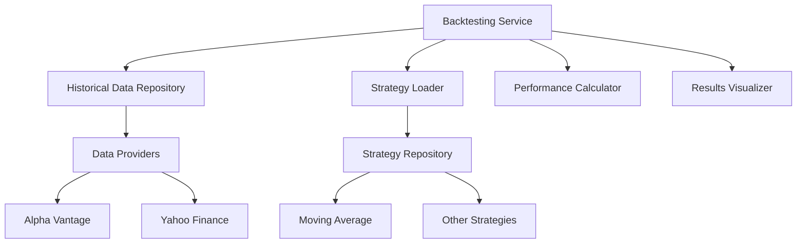
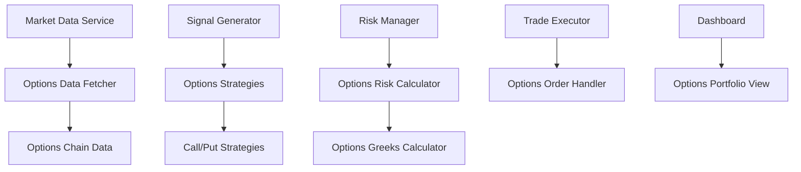
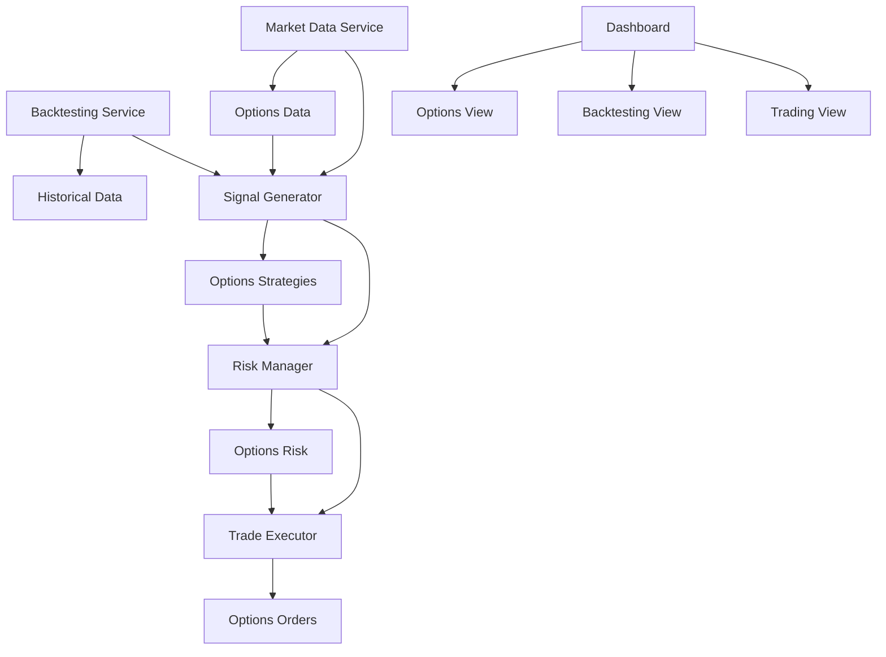

# Algorithmic Trading System Enhancement Plan

Based on my analysis of your existing codebase and your requirements, I'll outline a comprehensive plan to enhance your algorithmic trading system with backtesting capabilities and options trading support.

## Current System Overview

Your existing system has a solid foundation with a microservices architecture in Go:

1. **Market Data Service**: Fetches data from Alpha Vantage/Yahoo Finance
2. **Signal Generator**: Implements trading strategies (currently Moving Average Crossover)
3. **Risk Manager**: Evaluates risk/reward and enforces trading limits
4. **Trade Executor**: Handles order placement and execution
5. **Dashboard**: Provides monitoring and analytics

The system uses Redis for caching, PostgreSQL with TimescaleDB for storage, and has a React frontend.

## Enhancement Plan

### 1. Backtesting Module

We'll add a new backtesting service that will allow you to test your trading strategies against historical data.

#### Architecture



#### Components

1. **Historical Data Repository**
   - Store and manage historical price data
   - Support for different timeframes (1m, 5m, 15m, 1h, 1d)
   - Data normalization and cleaning

2. **Strategy Loader**
   - Load trading strategies from the existing signal generator
   - Configure strategy parameters for testing

3. **Performance Calculator**
   - Calculate basic performance metrics:
     - Total return
     - Win/loss ratio
     - Maximum drawdown
     - Sharpe ratio
     - Average trade duration

4. **Results Visualizer**
   - Generate performance charts
   - Compare strategy performance
   - Export results to CSV/JSON

#### Implementation Plan

1. Create a new service in `cmd/backtester`
2. Implement historical data fetching and storage
3. Create a strategy runner that simulates trades
4. Implement performance metrics calculation
5. Add API endpoints for the dashboard
6. Create visualization components in the frontend

### 2. Options Trading Support

We'll extend the existing system to support options trading with basic pricing models.

#### Architecture



#### Components

1. **Options Data Fetcher**
   - Fetch options chain data from providers
   - Store and update options data

2. **Options Strategies**
   - Implement basic call/put trading strategies
   - Signal generation for options

3. **Options Risk Calculator**
   - Calculate risk metrics for options trades
   - Implement basic pricing models (Black-Scholes)
   - Calculate simple Greeks (Delta, Gamma)

4. **Options Order Handler**
   - Execute options trades
   - Manage options positions

5. **Options Portfolio View**
   - Display options positions
   - Show options-specific metrics

#### Implementation Plan

1. Extend market data service to fetch options data
2. Create options models in `pkg/models`
3. Implement Black-Scholes pricing model in `pkg/options`
4. Add options strategies in `internal/signal-generator/strategies`
5. Extend risk manager to handle options risk
6. Update trade executor for options orders
7. Add options views to the dashboard

### 3. System Integration

We'll integrate these new components with the existing system:



## Implementation Roadmap

### Phase 1: Backtesting Framework (2-3 weeks)

1. **Week 1**: Set up historical data fetching and storage
   - Implement data providers for historical data
   - Create database schema for historical data
   - Develop data normalization utilities

2. **Week 2**: Implement backtesting engine
   - Create strategy runner
   - Implement trade simulation
   - Develop performance metrics calculation

3. **Week 3**: Build backtesting UI
   - Create API endpoints for backtesting
   - Develop frontend components for backtesting
   - Implement results visualization

### Phase 2: Options Trading Support (3-4 weeks)

1. **Week 1**: Implement options data models and fetching
   - Create options chain data models
   - Implement options data fetching from providers
   - Set up storage for options data

2. **Week 2**: Develop options pricing and Greeks
   - Implement Black-Scholes model
   - Create basic Greeks calculations
   - Develop options risk assessment

3. **Week 3**: Build options trading strategies
   - Implement basic call/put strategies
   - Create options signal generator
   - Develop options position management

4. **Week 4**: Create options trading UI
   - Develop options chain view
   - Create options portfolio view
   - Implement options order entry

### Phase 3: Integration and Testing (2 weeks)

1. **Week 1**: System integration
   - Connect all components
   - Implement end-to-end workflows
   - Perform integration testing

2. **Week 2**: Performance optimization and documentation
   - Optimize critical paths
   - Document new features
   - Create user guides

## Technical Specifications

### 1. New Packages and Files

```
algo-trading/
├── cmd/
│   └── backtester/
│       └── main.go
├── internal/
│   ├── backtester/
│   │   ├── service.go
│   │   ├── historical_data.go
│   │   ├── strategy_runner.go
│   │   └── performance.go
│   ├── options/
│   │   ├── service.go
│   │   ├── pricing.go
│   │   └── greeks.go
│   └── signal-generator/
│       └── strategies/
│           └── options_strategies.go
├── pkg/
│   ├── models/
│   │   └── options.go
│   └── options/
│       ├── black_scholes.go
│       └── greeks.go
└── web/
    └── src/
        └── pages/
            ├── Backtester.tsx
            └── OptionsTrading.tsx
```

### 2. Database Schema Extensions

```sql
-- Options chain table
CREATE TABLE options_chain (
    id SERIAL PRIMARY KEY,
    underlying_symbol VARCHAR(10) NOT NULL,
    option_type VARCHAR(4) NOT NULL,
    strike_price DECIMAL(10, 2) NOT NULL,
    expiration_date DATE NOT NULL,
    bid DECIMAL(10, 2),
    ask DECIMAL(10, 2),
    last_price DECIMAL(10, 2),
    volume INTEGER,
    open_interest INTEGER,
    implied_volatility DECIMAL(10, 4),
    delta DECIMAL(10, 4),
    gamma DECIMAL(10, 4),
    theta DECIMAL(10, 4),
    vega DECIMAL(10, 4),
    created_at TIMESTAMP WITH TIME ZONE DEFAULT NOW(),
    updated_at TIMESTAMP WITH TIME ZONE DEFAULT NOW()
);

-- Historical data table
CREATE TABLE historical_data (
    id SERIAL PRIMARY KEY,
    symbol VARCHAR(10) NOT NULL,
    timestamp TIMESTAMP WITH TIME ZONE NOT NULL,
    open DECIMAL(10, 2) NOT NULL,
    high DECIMAL(10, 2) NOT NULL,
    low DECIMAL(10, 2) NOT NULL,
    close DECIMAL(10, 2) NOT NULL,
    volume INTEGER NOT NULL,
    timeframe VARCHAR(5) NOT NULL,
    UNIQUE(symbol, timestamp, timeframe)
);

-- Backtesting results table
CREATE TABLE backtest_results (
    id SERIAL PRIMARY KEY,
    strategy_name VARCHAR(50) NOT NULL,
    start_date TIMESTAMP WITH TIME ZONE NOT NULL,
    end_date TIMESTAMP WITH TIME ZONE NOT NULL,
    symbols TEXT[] NOT NULL,
    parameters JSONB NOT NULL,
    total_return DECIMAL(10, 4) NOT NULL,
    win_rate DECIMAL(5, 2) NOT NULL,
    max_drawdown DECIMAL(5, 2) NOT NULL,
    sharpe_ratio DECIMAL(5, 2),
    trade_count INTEGER NOT NULL,
    created_at TIMESTAMP WITH TIME ZONE DEFAULT NOW()
);
```

### 3. API Endpoints

```
# Backtesting API
GET /api/backtest/strategies - List available strategies
POST /api/backtest/run - Run a backtest
GET /api/backtest/results/:id - Get backtest results
GET /api/backtest/results - List all backtest results

# Options API
GET /api/options/chains/:symbol - Get options chain for a symbol
GET /api/options/positions - Get current options positions
POST /api/options/orders - Place an options order
GET /api/options/calculator - Calculate option price and Greeks
```

## Questions for Consideration

Before finalizing this plan, I'd like to get your feedback on a few key points:

1. Do you have specific options data providers in mind, or should we integrate with the existing Alpha Vantage/Yahoo Finance setup?
2. Are there specific backtesting performance metrics that are most important to you?
3. Do you have any preferences for the backtesting UI/UX?
4. Would you like to prioritize any specific part of this enhancement plan?